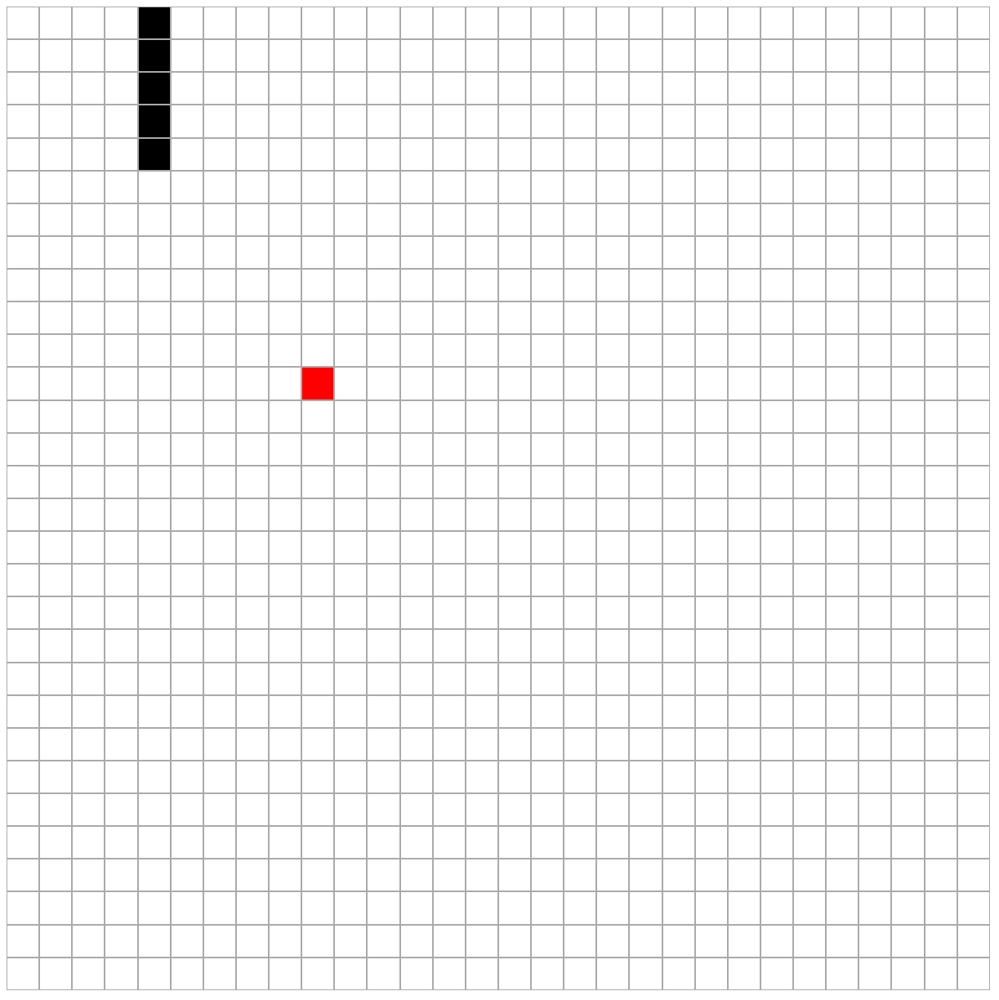

# Snake Game ([Preview](qiming-liu.github.io/Snack/index.html))

This is a simple implementation of the Snake game using JavaScript and HTML.

## Features

- Control the snake's movement direction using arrow keys.
- The snake grows when it eats food.
- The game ends when the snake hits the wall or itself.

## How to Run

1. Ensure you have a JavaScript-enabled browser.
2. Open the `index.html` file to start the game.

## Code Structure

- `snack.js`: Contains the main logic of the game.
- `index.html`: The HTML structure of the

## Screenshot

## Contribution

Feel free to submit issues and requests.
